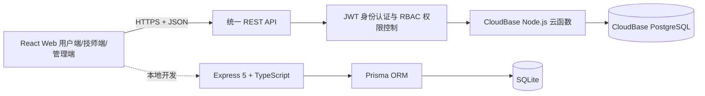

# 罗汉到家：后端技术栈与架构说明

> 项目定位：面向上门按摩 O2O 场景的全栈 MVP。线上演示不是纯前端 Mock，而是由腾讯云 CloudBase 云函数和 PostgreSQL 提供共享数据服务；本地开发同时保留 Express + Prisma + SQLite 后端，便于调试和扩展。

## 1. 总体架构



前端只依赖统一的 `/api/*` 接口契约，因此本地后端和线上云函数可以互换。这样既能保持本地开发简单，也能在免费额度内提供可跨设备访问、数据可持久化的线上演示。

## 2. 核心技术栈

| 分层 | 技术 | 项目中的作用 |
| --- | --- | --- |
| 线上运行时 | Tencent CloudBase、Node.js 20 | 承载 HTTP 云函数，按请求执行后端逻辑 |
| 线上数据库 | CloudBase PostgreSQL | 保存用户、技师、服务、订单、积分和审计数据 |
| 本地 API | Express 5、TypeScript | 提供模块化 REST API，便于本地联调和类型检查 |
| 本地数据层 | Prisma 6、SQLite | 数据建模、关系查询、迁移和本地持久化 |
| 参数校验 | Zod | 校验注册、技师档案、排班和订单请求 |
| 身份认证 | JWT（HS256） | 保存用户 ID 和角色，线上 Token 有效期 7 天 |
| 密码安全 | Node.js `crypto.scrypt` | 随机盐哈希密码，并用恒定时间比较验证 |
| 权限模型 | RBAC | 隔离 USER、TECHNICIAN、ADMIN 三种身份的接口权限 |
| API 安全 | Helmet、CORS、请求体大小限制 | 设置安全响应头、限制跨域来源和大请求体 |
| 自动化验证 | TypeScript、Puppeteer | 检查类型、按钮反馈、登录布局、管理端和技师端流程 |
| 部署 | CloudBase CLI、Surge | 免费部署后端云函数与前端静态资源 |

## 3. 后端模块划分

本地 Express 后端按照业务领域拆分，而不是把所有逻辑堆在单个路由文件中：

```text
server/src/
├─ middleware/
│  ├─ authentication.ts       JWT 身份认证
│  ├─ authorization.ts        角色权限控制
│  └─ error-handler.ts        统一错误响应
├─ modules/
│  ├─ auth/                    注册、密码/验证码登录
│  ├─ technicians/             技师列表与独立档期
│  ├─ orders/                  创建订单、取消、状态推进
│  ├─ profile/                 用户偏好、积分和历史记录
│  ├─ technician-workbench/    技师接单与履约工作台
│  └─ admin/                   看板、订单、用户、技师和服务管理
└─ shared/                     数据库、密码、错误和订单状态工具
```

线上 `cloudfunctions/luohan-api/` 使用事件式路由实现同一套接口。云函数版本减少了常驻服务器成本，适合当前小体量、坚持免费额度的面试演示环境。

## 4. 数据模型

主要实体及关系如下：

- `User`：账号、角色、手机号、积分、偏好和密码哈希。
- `Technician`：技师资料、头像、位置、评分、从业经验、上下线状态和归档状态。
- `Service`：服务名称、说明、价格、时长和上下架状态。
- `TechnicianService`：技师与服务的多对多关系。
- `Order`：用户、技师、服务、预约时间、地址、价格和当前状态。
- `OrderStatusLog`：记录每一次订单状态变化，支持履约追踪。
- `Favorite`：用户收藏技师的复合主键关系。
- `PointRecord`：记录积分收入和原因。
- `AuditLog`：记录管理员创建、修改、归档和恢复等操作。

订单表对 `(technicianId, appointmentAt)` 建立索引，便于按技师检查档期；用户订单对 `(userId, createdAt)` 建立索引，便于查询历史订单。

## 5. 身份认证与权限

登录成功后，后端签发 JWT，载荷包含用户 ID 与角色。客户端后续通过 `Authorization: Bearer <token>` 访问受保护接口。

权限边界：

- `USER`：维护个人偏好、收藏、创建和查看自己的订单。
- `TECHNICIAN`：查看分配给自己的订单并推进履约状态。
- `ADMIN`：查看经营数据，管理订单、用户、技师、服务和排班。

管理员接口不会仅依赖前端隐藏按钮，而是由后端再次验证角色。密码不保存明文，采用带随机盐的 scrypt 哈希；JWT 密钥与 CloudBase API Key 仅存在于服务端环境变量中，不进入前端构建产物和 Git 仓库。

## 6. 订单与排班设计

订单状态机为：

```text
待接单 → 已接单 → 已出发 → 已到达 → 服务中 → 已完成
```

取消订单作为独立终止状态。后端按照合法状态顺序推进，避免前端任意跳转。

每位技师拥有独立的 `workDays`、`workStart` 和 `workEnd`。创建订单时，后端会依次校验：

1. 技师和服务是否有效、是否已上线；
2. 该技师是否提供所选服务；
3. 日期是否属于未来三天；
4. 是否为北京时间下的未来时段；
5. 是否属于该技师的接单日和工作时间；
6. 同一技师、同一时间是否已有未取消订单。

档期冲突始终带 `technicianId` 查询，因此 A 技师 20:00 被预约不会占用 B 技师 20:00。前端会提前显示“已过时、休息、非接单、已约满”，后端仍进行最终校验，防止绕过界面直接提交。

## 7. 管理端真实数据能力

管理端经营看板的数据来自数据库聚合，包括订单总量、待接订单、已完成营收、在线技师、用户数量、七日趋势和状态分布。除此之外还支持：

- 按订单号、用户、手机号、技师和状态筛选订单；
- 查看用户订单量、消费额、积分、偏好和注册时间；
- 新增、编辑、上下线、排班、归档和恢复技师；
- 上传技师头像并在浏览器压缩至 100 KB 内；
- 新增、上下架服务，并分配给不同技师；
- 归档技师时保留历史订单，存在进行中订单时阻止归档。

## 8. API 设计示例

| 方法 | 路径 | 权限 | 用途 |
| --- | --- | --- | --- |
| `POST` | `/api/auth/register` | 公开 | 用户注册 |
| `POST` | `/api/auth/login` | 公开 | 密码或演示验证码登录 |
| `GET` | `/api/technicians` | 公开 | 获取可预约技师 |
| `GET` | `/api/technicians/:id/availability` | 公开 | 获取技师独立排班与已占档期 |
| `POST` | `/api/orders` | USER | 创建订单 |
| `POST` | `/api/orders/:id/cancel` | USER | 取消订单 |
| `GET` | `/api/admin/dashboard` | ADMIN | 获取经营看板 |
| `POST` | `/api/admin/technicians` | ADMIN | 新增技师 |
| `DELETE` | `/api/admin/technicians/:id` | ADMIN | 软归档技师 |
| `PATCH` | `/api/admin/technicians/:id/restore` | ADMIN | 恢复已归档技师 |

所有接口统一返回：

```json
{ "data": {} }
```

失败时统一返回：

```json
{ "error": { "code": "REQUEST_FAILED", "message": "可读的错误说明" } }
```

## 9. 部署与环境隔离

线上链路：

```text
Surge 静态前端 → CloudBase HTTP 云函数 → CloudBase PostgreSQL
```

本地链路：

```text
Vite 开发服务器 → Express API → Prisma → SQLite
```

仓库只提交 `.env.example`，真实 `.env`、数据库文件和密钥均由 `.gitignore` 排除。线上配置通过 CloudBase 环境变量管理。

## 10. 当前取舍与后续演进

该项目是面试 MVP，不是正式生产系统。当前为控制成本做了以下取舍：

- 头像压缩后直接写入技师记录；规模扩大后应迁移到对象存储和 CDN。
- 验证码为固定演示验证码；正式环境应接入短信服务、频率限制和验证码过期机制。
- 支付、客服通信和定位移动为演示实现；正式环境需要支付回调、消息推送与实时位置通道。
- 当前档期冲突通过查询后写入实现；高并发环境应增加数据库唯一约束、事务或分布式锁。
- JWT 当前为短链路演示方案；正式环境可增加刷新令牌、吊销列表和设备管理。

后续可以进一步引入 Redis 缓存、消息队列、对象存储、日志监控、接口限流、数据库备份和 CI/CD，将当前 MVP 演进为可商用架构。

## 11. 面试说明重点

这个项目的后端亮点不在于技术数量，而在于完整业务闭环：

1. 三种角色由后端权限隔离；
2. 订单状态、积分、准时率会随履约真实变化；
3. 技师排班和订单占用按技师独立计算；
4. 管理端读取并修改真实共享数据库；
5. 归档代替物理删除，保留历史数据和审计能力；
6. 本地与云端保持统一 API 契约，兼顾开发效率与免费线上演示。
