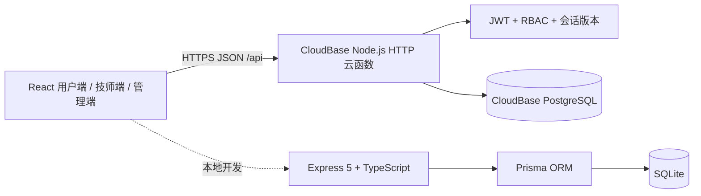

# 罗汉到家：后端技术栈、架构与后续规划

> 文档版本：2026-09-23。项目是可在线演示的上门按摩 O2O 全栈 MVP，不是纯前端 Mock。生产数据由腾讯云 CloudBase 云函数与 PostgreSQL 持久化；本地保留 Express + Prisma + SQLite 作为类型更完整、便于调试的开发后端。

## 1. 系统目标与边界

后端承担账号、技师、服务、档期、订单、履约、评价、积分及经营管理八类核心能力。当前目标是让面试官能用用户、技师、管理员三种身份完成可信业务闭环，同时保持小体量免费部署。



前端只依赖统一 REST 契约，因此可在不改页面业务逻辑的情况下切换线上云函数与本地 Express。线上方案降低常驻服务器费用；本地方案提供 Prisma 数据模型、类型检查和快速联调体验。

## 2. 技术栈

| 层级 | 技术 | 用途与选择原因 |
| --- | --- | --- |
| 线上运行时 | Tencent CloudBase、Node.js 20 | 国内访问友好，HTTP 云函数按请求运行，适合免费演示 |
| 线上数据库 | CloudBase PostgreSQL | 多账号共享、关系查询和持久化经营数据 |
| 本地 API | Express 5、TypeScript | 路由与领域模块清晰，便于类型检查和后续拆分 |
| 本地数据访问 | Prisma 6、SQLite | 声明式模型、关系查询、迁移；无需额外安装数据库 |
| 输入校验 | Zod + 云函数等价校验 | 拒绝非法手机号、价格、排班、服务和状态输入 |
| 身份认证 | JWT HS256 | 无状态鉴权，适合云函数；令牌有效期 7 天 |
| 密码安全 | `crypto.scrypt` + 随机盐 | 数据库不存明文密码，恒定时间比较哈希 |
| 权限控制 | RBAC | USER、TECHNICIAN、ADMIN 三种角色由服务端隔离 |
| Web 安全 | Helmet、CORS 白名单、Body 限制 | 降低常见响应头、跨域和大请求风险 |
| 自动化验证 | TypeScript、Puppeteer、Node 脚本 | 覆盖构建、按钮反馈、角色空间、账号隔离和改密 |
| 部署 | CloudBase CLI、Surge | 云函数/数据库与静态前端分离，当前可维持免费额度 |

## 3. 后端模块

```text
server/src/
├─ middleware/               JWT 鉴权、角色授权、错误处理
├─ modules/
│  ├─ auth/                  注册、登录、修改密码
│  ├─ technicians/           技师列表、详情、独立档期
│  ├─ orders/                下单、取消、状态机、评价
│  ├─ profile/               用户资料、地址、偏好、收藏、积分
│  ├─ technician-workbench/  技师订单与履约推进
│  └─ admin/                 看板、订单、用户、技师、服务管理
└─ shared/                   数据库、密码、会话版本、统一错误
```

线上 `cloudfunctions/luohan-api/` 实现相同接口：`index.js` 负责公共、认证和用户资料路由，其余按管理端、订单、技师工作台拆分。两套实现共享业务契约，避免前端为部署环境维护两套逻辑。

## 4. 数据模型

| 实体 | 关键数据 | 关系/用途 |
| --- | --- | --- |
| User | 手机号、姓名、角色、密码哈希、积分、偏好 | 登录主体；可关联技师档案或用户订单 |
| Technician | 头像、职称、位置、评分、经验、排班、上下线/归档 | 公开技师资料与工作台主体 |
| Service | 名称、说明、价格、时长、上下架 | 平台可配置服务目录 |
| TechnicianService | technicianId、serviceId | 技师与服务多对多关系 |
| Order | 用户、技师、服务、预约时间、地址、金额、状态 | 交易与履约主记录 |
| OrderStatusLog | orderId、status、createdAt | 订单状态审计轨迹 |
| Favorite | userId、technicianId | 每个用户独立收藏关系 |
| PointRecord | userId、变动值、原因 | 积分账本，避免只保存余额 |
| AuditLog | 操作人、动作、目标、元数据 | 管理员关键操作留痕 |

用户地址目前与偏好一起以 JSON 存储在 `User.preferences`，这是免费 MVP 的兼容性取舍；进入商用阶段后会拆为 Address 表并增加默认地址约束。

## 5. 认证、会话和权限

注册或登录后签发 JWT，载荷包括：

```json
{ "sub": "用户 ID", "role": "USER", "ver": "密码哈希指纹", "exp": 0 }
```

`ver` 是密码哈希的不可逆短指纹。每次受保护请求都会读取当前用户并比较指纹，因此用户修改密码或管理员重置技师密码后，所有旧令牌立即失效，无需增加收费缓存或修改数据库结构。前端改密成功后主动退出并要求使用新密码重新登录。

权限边界：

- USER：只读写自己的资料、地址、收藏、订单和评价。
- TECHNICIAN：只能读取分配给自己的订单，并按状态机推进履约。
- ADMIN：读取经营聚合，管理订单、用户、服务、技师档案和账号。

新建技师时同步创建工作台账号。历史未绑定档案可在管理端填写手机号和初始密码完成绑定；手机号全局唯一。公共面试演示账号禁止改密或被重置，避免后续访问者无法登录。

## 6. 核心业务规则

### 6.1 档期与下单

每个技师拥有独立的 `workDays`、`workStart`、`workEnd`。可预约性依次校验：技师/服务有效、技师提供该服务、日期在开放范围、北京时间尚未过去、属于该技师排班、同一技师同一时间没有未取消订单。

冲突查询始终包含 `technicianId`，所以 A 技师 20:00 被预约不会占用 B 技师 20:00。前端用于即时提示，后端保留最终校验，防止绕过页面提交。

### 6.2 订单状态机

```text
待接单 → 已接单 → 已出发 → 已到达 → 服务中 → 已完成
                         └──────── 可取消的终止状态
```

状态不能任意跳跃。到达时记录准时数据；完成后写入用户积分及积分流水。订单管理可按订单号、用户、手机号、技师和状态筛选，并展示下单时间与预约时间。

### 6.3 评价、指标与归档

已完成订单仅可评价一次，评价结果落库并重新计算技师评分。准时率初始为 100%，之后按真实到达记录计算；从业经验由管理员依据资质填写。技师“删除”采用软归档，保留历史订单；有进行中订单时拒绝归档。

## 7. 主要 API

| 方法 | 路径 | 权限 | 用途 |
| --- | --- | --- | --- |
| POST | `/api/auth/register` | 公开 | 用户注册 |
| POST | `/api/auth/login` | 公开 | 密码/演示验证码登录 |
| GET | `/api/auth/me` | 已登录 | 校验会话并返回当前账号 |
| PUT | `/api/auth/password` | 已登录 | 修改密码并使旧会话失效 |
| GET | `/api/technicians/:id/availability` | 公开 | 获取该技师排班和占用时段 |
| POST | `/api/orders` | USER | 创建订单 |
| POST | `/api/orders/:id/review` | USER | 提交完成订单评价 |
| GET | `/api/admin/dashboard` | ADMIN | 经营看板聚合 |
| POST | `/api/admin/technicians` | ADMIN | 新建技师及登录账号 |
| POST | `/api/admin/technicians/:id/bind-account` | ADMIN | 为旧档案绑定账号 |
| POST | `/api/admin/technicians/:id/reset-password` | ADMIN | 重置技师密码并注销旧会话 |
| DELETE | `/api/admin/technicians/:id` | ADMIN | 软归档技师 |

成功统一返回 `{ "data": ... }`，失败统一返回 `{ "error": { "code": "...", "message": "..." } }`，便于前端集中处理反馈。

## 8. 部署、配置与测试

生产链路：`Surge 静态前端 → CloudBase HTTP 云函数 → CloudBase PostgreSQL`。本地链路：`Vite → Express → Prisma → SQLite`。

仓库仅提交 `.env.example`；JWT 密钥、CloudBase API Key、数据库连接等真实配置不进入 Git。生产 CORS 只允许正式前端域名。常用检查：

```bash
npm run build
npm run check:role-workspaces
node scripts/check-account-isolation.mjs
node scripts/check-account-workflows.mjs
node scripts/check-password-change.mjs
```

自动化覆盖账号资料隔离、收藏隔离、技师工作台身份、地址持久化、评价、管理员重置密码，以及改密后旧令牌失效。线上写测试会恢复临时密码，避免污染演示账号。

## 9. 当前取舍和风险

- 固定验证码仅用于公开演示，不发送真实短信；正式产品必须接入验证码过期、频率限制和风控。
- 技师头像当前压缩至 100 KB 后随记录保存；规模扩大应迁移到对象存储与 CDN。
- 支付、聊天、定位移动属于交互演示，没有真实资金回调和持续位置通道。
- 云函数版本以应用层查询防止档期冲突；高并发下应增加数据库唯一约束与事务重试。
- 本地与云端存在双实现维护成本；接口契约必须通过回归脚本保持一致。
- 当前访问令牌 7 天有效且改密可整体失效，但没有多设备会话列表和单设备退出。

## 10. 后续规划

### P0：面试演示稳定性（当前阶段）

- 保持三角色主流程、账号隔离、档期、订单状态、评价与管理端全链路可回归。
- 增加云函数错误告警、数据库备份说明和部署后烟雾测试。
- 为关键写操作增加请求幂等键，避免弱网重复下单。

### P1：小规模真实运营

- 将 Address、Review 拆为独立表，支持评价文本、标签、申诉与管理端审核。
- 头像迁移至对象存储；接入受限短信、支付沙箱、消息通知和退款状态。
- 引入短效 Access Token + Refresh Token、设备会话管理、登录限流和异常登录记录。
- 增加管理员审计日志页面、细粒度权限、数据导出和敏感字段脱敏。
- 完善订单并发事务、超时自动取消、技师请假/停排和服务时长占用。

### P2：规模化与可靠性

- Redis 缓存和分布式锁、消息队列处理通知/积分/统计，WebSocket 或推送承载实时状态。
- 可观测性：结构化日志、链路追踪、指标、告警与错误聚合。
- PostgreSQL 高可用、自动备份与恢复演练；读写热点索引和慢查询治理。
- CI/CD 执行类型、单元、集成、E2E、安全扫描和分阶段发布。
- 完成隐私协议、数据最小化、账号注销、数据保留和支付/定位合规评审。

## 11. 补充

项目亮点不是堆叠技术名称，而是把真实业务规则落到服务端：三角色权限不能靠隐藏按钮；收藏和订单按账号隔离；技师档期独立；状态推进有约束；评价、积分、准时率来源可追溯；技师用归档保留历史；改密会注销旧会话；线上共享数据与本地工程化后端保持同一接口。后续规划说明了当前免费 MVP 的取舍，以及如何按业务增长逐步演进，而不是一开始过度设计。
