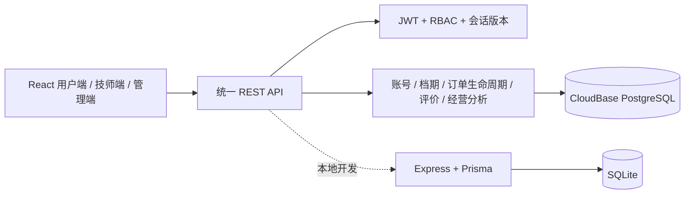

# 罗汉到家：技术栈、扩展路线与正式上线清单

> 更新日期：2026-09-23。本项目当前是可公开访问、具有真实账号与共享数据库的全栈面试 MVP。它已经不是纯静态页面，但支付、短信、即时通信和持续定位仍属于演示能力，不能直接作为商业生产系统运营。

## 1. 产品与系统现状

罗汉到家覆盖用户、技师、管理员三类角色：

- 用户：注册/登录、查看附近技师、收藏、选择服务和独立档期、预约、模拟支付、订单追踪、评价、积分与历史订单。
- 技师：登录独立工作台、查看自己的订单、按合法顺序推进接单、出发、到达、服务中、完成。
- 管理员：经营分析、订单/用户查询、技师及账号管理、服务项目管理、排班、归档与恢复。

订单状态由服务端维护，状态日志记录每个节点的真实发生时间；订单页按北京时间展示“创建、接单、出发、到达、开始服务、完成/取消”。待接单超过 15 分钟会进入“已取消”，并标记为系统超时。

## 2. 当前技术栈

| 层级 | 技术 | 当前用途 |
| --- | --- | --- |
| 前端框架 | React 19、TypeScript | 三角色单页应用、组件和业务状态类型 |
| 工程工具 | Vite、TypeScript Compiler | 本地开发、生产构建、前后端类型检查 |
| UI | 原生 CSS、View Transitions API | 移动端优先、桌面管理台、动画、安全区和响应式布局 |
| 地图 | 高德地图 JS API + 本地 SVG 降级 | 中国大陆地图、技师/用户位置及路线演示 |
| 线上 API | Tencent CloudBase HTTP 云函数、Node.js 20 | 登录、资料、档期、订单、评价、履约和管理接口 |
| 线上数据 | CloudBase PostgreSQL | 跨设备共享账号和业务数据 |
| 本地 API | Node.js、Express 5、TypeScript | 与线上 API 契约一致的本地开发后端 |
| 本地数据 | Prisma 6、SQLite | 数据建模、关系查询、事务和种子数据 |
| 鉴权 | JWT HS256、RBAC、会话版本 | USER/TECHNICIAN/ADMIN 权限隔离；改密后旧 Token 失效 |
| 安全基础 | scrypt 密码哈希、随机盐、CORS、Helmet、Zod | 密码保护、来源限制、安全响应头和输入校验 |
| 前端接口层 | Fetch 封装、统一错误和 401 处理 | 统一 `{data}` / `{error}` 协议及失效登录跳转 |
| 部署 | Surge、CloudBase CLI | HTTPS 静态页面与国内云函数部署 |
| 质量保障 | Node 回归脚本、Puppeteer、TypeScript | 登录布局、按钮反馈、账号隔离、生产保护、取消分类和时间线检查 |

## 3. 当前后端架构

主要数据实体：User、Technician、Service、TechnicianService、Order、OrderStatusLog、Favorite、PointRecord、AuditLog。关键写操作包括请求幂等、档期二次校验、状态机约束；本地后端使用 Prisma 事务，线上免费云函数版本使用幂等键和写后竞争仲裁降低重复下单及并发占用风险。

## 4. 当前真实能力与演示能力

### 已真实落库

- 用户注册、密码登录、三角色账号及权限。
- 用户资料、地址、偏好、收藏和积分流水。
- 技师资料、头像、服务项目、排班、上下线和归档。
- 订单、金额快照、预约时间、独立技师档期和状态日志。
- 评价星级、标签、文字及技师评分聚合。
- 经营指标、技师排行、服务销量、复购率、客单价和履约漏斗。

### 仍是演示实现

- 支付按钮不产生真实扣款，也没有支付机构回调与退款。
- 验证码是固定演示码，不发送短信。
- 在线聊天是本地交互，不是实时通信。
- 技师位置为模拟移动，不是技师设备持续上报。
- 待接单超时采用接口访问时的惰性扫描，而非独立调度器。
- Surge 与 CloudBase 免费额度适合面试演示，不提供商业 SLA。

## 5. 后续扩展方向

### 第一阶段：小规模试运营

- 将 Address、Review、Coupon、Refund 拆为独立数据表。
- 接入云对象存储与 CDN，头像和资质文件只在数据库保存 URL。
- 增加技师请假、临时停排、服务半径、通勤缓冲时间和人工改派。
- 使用 CloudBase 定时任务扫描超时订单并发送通知。
- 管理端增加取消原因、异常备注、评价审核和 CSV 导出。
- 增加登录限流、设备会话、操作审计页面和敏感信息脱敏。

### 第二阶段：真实交易与履约

- 接入微信支付/支付宝：服务端预下单、签名校验、异步回调、对账、退款和幂等。
- 接入合规短信服务，包含验证码有效期、频率限制、图形验证和黑名单。
- 技师 App/小程序上报定位；服务端校验时间、坐标和设备身份。
- 使用 WebSocket、SSE 或平台推送同步接单、位置、取消和服务状态。
- 增加客服介入、投诉、赔付、爽约责任和证据链。

### 第三阶段：规模化

- 统一为一套生产后端，减少本地 Express 与云函数双实现成本。
- 数据库唯一约束、可序列化事务或可靠的档期锁，彻底解决高并发抢同一时段。
- Redis 缓存与分布式锁；消息队列异步处理通知、积分、统计和退款。
- 结构化日志、指标、链路追踪、错误聚合、分级告警和容量规划。
- 读写索引、慢查询治理、自动扩缩容、灰度发布和故障降级。

## 6. 正式上线前必须补充

### P0：没有这些不能收真实订单

1. **主体与合规**：公司主体、ICP备案、公安备案、服务协议、隐私政策、账号注销、个人信息收集清单和定位授权说明。
2. **技师治理**：实名认证、资质审核、背景核验、健康证明、培训、保险、服务规范和违规处置。
3. **真实支付**：支付回调验签、金额服务端确认、退款、对账、发票和资金异常处理。
4. **订单一致性**：数据库事务/唯一约束、可靠超时任务、重复回调幂等、改派和故障补偿。
5. **隐私安全**：HTTPS、密钥托管、数据库最小权限、地址/手机号加密或脱敏、文件访问签名、登录限流和防刷。
6. **运维可靠性**：生产/测试环境隔离、自动备份、恢复演练、日志、监控、告警、故障预案和明确 SLA。
7. **客户保障**：客服入口、投诉、取消和退款规则、紧急联系人、服务安全码、事故上报和保险理赔流程。

### P1：上线初期应尽快具备

- 优惠券、会员和积分账务规则，避免只改余额没有流水。
- 技师结算、平台抽佣、提现、税务与财务对账。
- 内容和评价审核、风控策略、设备与异常登录记录。
- 自动化单元/集成/E2E 测试，GitHub Actions 构建、安全扫描和分阶段发布。
- 数据分析口径文档、埋点、转化漏斗、留存、复购和渠道归因。
- 无障碍、弱网、低端手机、不同屏幕和主流微信内置浏览器测试。

## 7. 推荐的生产技术演进

短期无需为了“技术多”而重写。推荐先保留 React 前端，将后端统一到 CloudBase 或国内云容器中的 Node.js 服务，生产数据库使用托管 PostgreSQL，对象文件进入 COS/CDN。订单与支付保持强一致，通知和统计使用消息队列异步化。

当订单量和团队规模明显增长后，再评估 Redis、消息队列、WebSocket 网关、独立风控/结算服务。拆服务的依据应是吞吐、团队边界和故障隔离，而不是面试展示。

## 8. 面试说明重点

这个项目的技术价值不是页面数量，而是完整业务闭环：三角色权限由后端验证；用户数据相互隔离；每个技师档期独立；下单具有幂等和冲突保护；订单按状态机推进并保留真实时间线；超时取消与主动取消可区分；评价和经营指标来自共享数据库。同时，文档清楚说明了免费 MVP 与商业系统之间的边界及演进路线。
